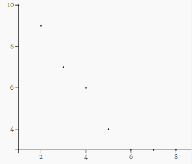

# SCINCE FAIR ~~POSTER~~ WEBSITE
### Laget av Didrik Wiig-Andersen <br></br>

### Denne nettsiden inneholder besvarelser for følgende oppgaver:
- [Terningkast](#Terningkast)
- [Radiokativitet](#Radioaktivitet)

## Terningkast
### **Hvor mange ganger må man regne med å kaste en terning for å få en sekser?**
En sekssidet terning viser kun én side etter å ha blitt kastet. På bakgrunn av dette er sannsynligheten for å få et spesielt ønsket tall 1/6 eller 16.7%. Basert på sannsynligheten må man derfor regne med å kaste en terning seks ganger for å få et ønsket tall (en sekser). Det er likevel slik at man i virkeligheten kan oppleve å få ønsket tall på første kast, eller å ikke få ønskede tall selv om man har kastet 10 ganger. 

```
import random

t = 0

while t < 6:
t = random.randint(1, 6)
print(t)
```

Koden vil fungere likt som en terning hvor målet er å få en sekser. **Koden fungerer slik:**

```
import random
```
Vi begynner med å inkludere python biblioteket **random** som blant annet inneholder `methods` slik som **.randint(x, y)**. Med **.randint(x, y)** kan vi få tilfeldige tall innenfor <x, y> intervallet. 

```
t = 0
```
Vi lager en variabel (int) med navn **t** og setter dens verdi til 0. 

```
while t < 6:
t = random.randint(1, 6)
print(t)
```
Vi setter dermed opp en `while - loop` som vil kjøre så lenge verdien av t er under 6. Loopen vil kjøre minst èn gang fordi t er satt til 0 i begynnelsen av programmet. t vil dermed få en ny, tilfeldig, verdi mellom 1 og 6 og videre printes til terminalen. Loopen kjører igjen dersom t < 6.


## Radioaktivitet
### **Hvordan utvikler terningium-atomer seg over tid?**
I denne algoritmen undersøker vi terningkast videre. Som utgangspunkt har vi 10 terninger til å begynne med. Vi kan sammenlikne terningene med terningnium-atomer. Vi kaster terningene og terningene som viser tallet 6 blir tatt bort, mens de terningene som ikke viser tallet 6 kastes på nytt. Sett fra terningnium-atomets verden kan vi tenke oss at det henfaller x antall atomer ved hvert «kast», eller minutt som beskrevet i oppgaven. De atomene som henfaller, er ikke lenger fullverdige terningium-atomer og vi kan tenke på dem som «fjernet» fra den totale mengden av atomer (10 stk.). Ved neste kast/minutt skjer denne prosessen på nytt, en prosess som i helhet skjer 11 ganger i total (første gang + 10 loops). 

Vi kan derfor svare på problemstillingen følgende; Vi kan forvente terning nummer 6 for hvert sjette kast, dvs. et henfall for hvert sjette minutt (samme sannsynlighet for å forekomme 16.7%). Ettersom terningene og atomene er prikk like vil det minst fjernes/henfalle en terning/atom per kast/minutt helt frem til vi står igjen med fem terninger (kan her, basert på sannsynligheten, ikke forvente at det fjernes/henfaller en terning/atom). Sannsynligheten for riktig tall/henfall avtar naturligvis med færre terninger/atomer. Over tid vil derfor antall terningium-atomer avta, hvor vi vil oppleve at det avtar flest da vi har flere atomer (begynnelsen) og færre vil avta da vi har færre atomer.   

```
import matplotlib.pyplot as plt
import random

N = 10      # Antall atomer/terninger
Tid = 10    # Antall minutter/kast
atom = [1]*N # En liste med 10 atomer
antall = [sum(atom)]
print(atom, 'Antall atomer: ', antall)

while Tid > 0:
    for i in range(N):
        kast = random.randint(1, 7)
        if kast == 6:
            atom[i] = 0
    antall.append(sum(atom))
    print(atom, 'Antall atomer: ', sum(atom))
    Tid = Tid - 1

plt.plot(antall, '.')
plt.show()
```

For å besvare problemstillingen kan jeg forklare koden på følgende måte:
1. Vi definerer variablen *Tid* som symboliserer antall minutter som "looper" 10 ganger, eller i 10 minutter. 
2. Hvert minutt henfaller x atomer/kaster vi og får x seksere, dette vises i *for-loopen*, antall atomer som henfaller lagres som en int i listen *antall*.
3. Listen antall visulaiseres etter at loopen er ferdig å kjøre.

MERK! Som i den virkelige verden avtar summen av atomer etter hvert som de henfaller, det totale sannsynligheten for henfall vil derfor avta, noe vi opplever ved å kjøre programmet. Se grafen under (negativ vekst)



For mer en mer detlajert beskrivelse av hvordan koden fungerer, se under.

**Koden fungerer på følgende måte:**
```
import matplotlib.pyplot as plt
import random
```
Vi inkluderer bilbiotekene **random** og **matplotlib**. (Random er beskrevet over) **Matplotlib** gjør det mulig å visuallisere data (grafer, kakediagram, etc).

```
N = 10      # Antall atomer/terninger
Tid = 10    # Antall minutter/kast
atom = [1]*N # En liste med 10 atomer
antall = [sum(atom)]
print(atom, 'Antall atomer: ', antall)
```
Her definerer vi de nødvendige veriablene. N står som beskrevet for antall atomer/terniner og tid for antall minutter/kast. Vi lager dermed en liste med ti "like" atomer og finner antalle atomer ved å summere listen ved bruk av *sum()* funksjonen i en annen liste, antallet svarer til 10 stk. Vi printer dermed listen og antall atomer til terminalen. 

```
while Tid > 0:
    for i in range(N):
        kast = random.randint(1, 7)
        if kast == 6:
            atom[i] = 0
    antall.append(sum(atom))
    print(atom, 'Antall atomer: ', sum(atom))
    Tid = Tid - 1
```
Her har vi en "while loop" som kjører helt til variablen *Tid* er lik 0, verdien til *Tid* avtar med 1 per iterasjon. Vi har en *nested for-loop* som kjører 10 ganger, pga. "listelengden av variablen N, som har verdien 10". 

Vi definerer en ny variabel *kast* som får en tilfeldig verdi mellom 1 og 6 (7 ikke inkludert), for hver iterasjon av while-loopen. Vi sammenlikner dermed verdien til kast; dersom verdien er lik 6 settes listeverdien til atom ved *i* (avhenger av iterasjonssyklusen vi er på) lik 0. Videre summerer vi listen *atom* på nytt og setter inn et nytt ledd i listen *antall*. Vi skriver dermed listen *atom* og summer av *atom* ut til terminalen.  

```
plt.plot(antall, '.')
plt.show()
```

Her brukes biblioteket *matplotlib* beskrevet over for å tegne en graf av listen *antall*. 


